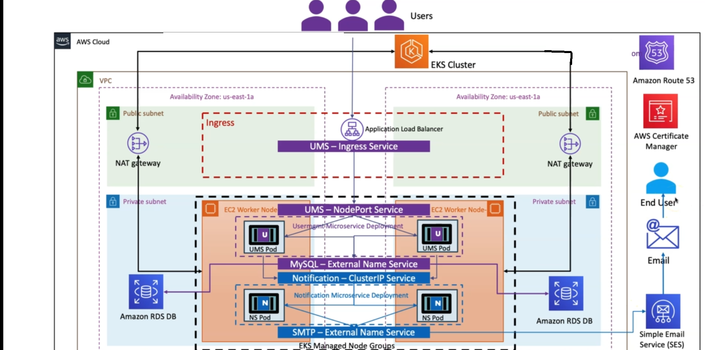

## Create RDS Database

### Review VPC of our EKS Cluster
- Go to Services -> VPC
- **VPC Name:**  eksctl-eksdemo1-cluster/VPC

### Pre-requisite-1: Create DB Security Group
- Create security group to allow access for RDS Database on port 3306
- Security group name: eks_rds_db_sg
- Description: Allow access for RDS Database on Port 3306 
- VPC: eksctl-eksdemo1-cluster/VPC
- **Inbound Rules**
  - Type: MySQL/Aurora
  - Protocol: TPC
  - Port: 3306
  - Source: Anywhere (0.0.0.0/0)
  - Description: Allow access for RDS Database on Port 3306 
- **Outbound Rules**  
  - Leave to defaults

### Pre-requisite-2: Create DB Subnet Group in RDS 
- Go to RDS -> Subnet Groups
- Click on **Create DB Subnet Group**
  - **Name:** eks-rds-db-subnetgroup
  - **Description:** EKS RDS DB Subnet Group
  - **VPC:** eksctl-eksdemo1-cluster/VPC
  - **Availability Zones:** us-east-1a, us-east-1b
  - **Subnets:** 2 subnets in 2 AZs
  - Click on **Create**

### Create RDS Database 
- Go to  **Services -> RDS**
- Click on **Create Database**
  - **Choose a Database Creation Method:** Standard Create
  - **Engine Options:** MySQL  
  - **Edition**: MySQL Community
  - **Version**: 5.7.22  (default populated)
  - **Template Size:** Free Tier
  - **DB instance identifier:** usermgmtdb
  - **Master Username:** dbadmin
  - **Master Password:** dbpassword11
  - **Confirm Password:** dbpassword11
  - **DB Instance Size:** leave to defaults
  - **Storage:** leave to defaults
  - **Connectivity**
    - **VPC:** eksctl-eksdemo1-cluster/VPC
    - **Additional Connectivity Configuration**
      - **Subnet Group:** eks-rds-db-subnetgroup
      - **Publicyly accessible:** YES (for our learning and troubleshooting - if required)
    - **VPC Security Group:** Create New
      - **Name:** eks-rds-db-securitygroup    
    - **Availability Zone:** No Preference
    - **Database Port:** 3306 
  - Rest all leave to defaults                
- Click on Create Database

### Edit Database Security to Allow Access from 0.0.0.0/0
- Go to **EC2 -> Security Groups -> eks-rds-db-securitygroup** 
- **Edit Inboud Rules**
  - **Source:** Anywhere (0.0.0.0/0)  (Allow access from everywhere for now)

you can check /notification-health-status or /notification-service-info ,/health-status
create user by postman client and you can recive mail 
